# 📁 คู่มือการพัฒนาระบบ Uploads (Developer Guide & Template)

เอกสารนี้จัดทำขึ้นเพื่อเป็น **Template และคู่มืออ้างอิง** สำหรับการพัฒนาฟีเจอร์ที่ต้องมีการอัปโหลดและจัดการไฟล์ในโปรเจกต์ ทั้งแบบ **Two-Phase Upload (แนะนำสำหรับฟอร์มทั่วไป)** และ **Direct Upload (สำหรับอัปโหลดทันที)**

---

## 🏗️ 1. สถาปัตยกรรมและแนวคิด (Architecture & Concepts)

ระบบจัดการไฟล์ถูกแบ่งออกเป็น 2 รูปแบบหลัก:

```mermaid
graph TD
    subgraph Pattern_A [Pattern A: Two-Phase Upload แนะนำสำหรับฟอร์มทั่วไป]
        A1[1. Client อัปโหลดไฟล์] -->|POST /api/uploads หรือ /single| A2[บันทึกไฟล์ใน public/uploads/temp/ <br> is_temp = 1]
        A2 -->|คืนค่า uploadId| A3[2. Client กรอกฟอร์มเสร็จ กดบันทึก]
        A3 -->|ส่ง uploadIds พร้อมข้อมูลฟอร์ม| A4[Service เรียก linkFiles หรือ syncFiles]
        A4 -->|ย้ายไฟล์ไป public/uploads/tableName/ <br> อัปเดต is_temp = 0| A5[(Database ตารางจริง)]
    end

    subgraph Pattern_B [Pattern B: Direct Upload สำหรับอัปโหลดทันที]
        B1[Client ส่งไฟล์ + ระบุ ref_table, ref_id] -->|POST /api/uploads/direct| B2[บันทึกและย้ายเข้าโฟลเดอร์จริงทันที <br> is_temp = 0]
    end
```



---

## 🗄️ 2. โครงสร้างตาราง `uploads`

ตาราง `uploads` ทำหน้าที่เป็นศูนย์กลางเก็บ Metadata ของทุกไฟล์ในระบบ:

| คอลัมน์ (Column) | ประเภท (Type) | คำอธิบาย |
| :--- | :--- | :--- |
| `id` | `SERIAL / INT PK` | รหัสไฟล์อ้างอิง |
| `original_name` | `VARCHAR(255)` | ชื่อไฟล์ต้นฉบับ (รองรับภาษาไทย) |
| `saved_name` | `VARCHAR(255)` | ชื่อไฟล์จริงในระบบ (UUID ป้องกันชื่อซ้ำ) |
| `path` | `VARCHAR(2000)` | URL Path เช่น `/uploads/projects/abc.pdf` |
| `mime_type` | `VARCHAR(100)` | ประเภท เช่น `image/png`, `application/pdf` |
| `size` | `BIGINT` | ขนาดไฟล์ (bytes) |
| `ref_table` | `VARCHAR(50)` | ชื่อตารางที่ผูก เช่น `projects`, `tasks`, `users` |
| `ref_id` | `INTEGER` | ID ของ Record ในตารางที่ผูก |
| `tag` | `VARCHAR(50)` | หมวดหมู่ไฟล์ เช่น `cover`, `attachment`, `avatar` |
| `sort_order` | `INTEGER` | ลำดับการแสดงผล (เริ่มที่ 1) |
| `is_temp` | `SMALLINT` | `1` = ชั่วคราว (ยังไม่ยืนยัน), `0` = ไฟล์จริง |
| `is_active` | `SMALLINT` | `1` = ใช้งาน, `0` = Soft Deleted |

---

## 💡 3. วิธีการนำ `UploadsService` ไปใช้ใน Module อื่น (Copy-Paste Examples)

### Step 1: นำเข้า `UploadsModule` ใน Feature Module
```typescript
// src/modules/projects/projects.module.ts
import { Module } from '@nestjs/common';
import { ProjectsController } from './projects.controller';
import { ProjectsService } from './projects.service';
import { UploadsModule } from '../uploads';

@Module({
  imports: [UploadsModule], // 👈 Import UploadsModule เพื่อใช้งาน UploadsService
  controllers: [ProjectsController],
  providers: [ProjectsService],
})
export class ProjectsModule {}
```

---

### Step 2: ใช้งานใน Service (`ProjectsService`)

```typescript
// src/modules/projects/projects.service.ts
import { Injectable, NotFoundException, BadRequestException } from '@nestjs/common';
import { FncDB, DbPoolService, FncCustom } from '../../toolsAK';
import { UploadsService } from '../uploads';
import { CreateProjectDto } from './dto/create-project.dto';
import { UpdateProjectDto } from './dto/update-project.dto';

@Injectable()
export class ProjectsService {
  constructor(
    private readonly db: FncDB,
    private readonly dbPool: DbPoolService,
    private readonly uploadsService: UploadsService, // 👈 Inject UploadsService
  ) {}

  // =================================================================
  // 1. CREATE: สร้างข้อมูลใหม่ พร้อมย้ายและผูกไฟล์จาก Temp
  // =================================================================
  async create(dto: CreateProjectDto, userId: string) {
    const client = await this.db.startTransaction();
    try {
      const now = FncCustom.dateNowBangkokString();

      // 1.1 บันทึกข้อมูลโครงการ
      const project = await this.db.insert('projects', {
        project_name: dto.projectName,
        description: dto.description,
        created_at: now,
        created_by: userId,
        updated_at: now,
        updated_by: userId,
      }, client);

      // 1.2 ผูกรูปภาพหน้าปก (Cover Image - tag: 'cover')
      if (dto.coverUploadIds?.length > 0) {
        await this.uploadsService.linkFiles({
          uploadIds: dto.coverUploadIds,
          refTable: 'projects',
          refId: Number(project.id),
          tag: 'cover',
          userId,
          client,
        });
      }

      // 1.3 ผูกเอกสารแนบ (Attachments - tag: 'attachment')
      if (dto.attachmentUploadIds?.length > 0) {
        await this.uploadsService.linkFiles({
          uploadIds: dto.attachmentUploadIds,
          refTable: 'projects',
          refId: Number(project.id),
          tag: 'attachment',
          userId,
          client,
        });
      }

      await this.db.commit(client);
      return { id: project.id, message: 'สร้างโครงการสำเร็จ' };
    } catch (error) {
      await this.db.rollback(client);
      throw error;
    }
  }

  // =================================================================
  // 2. FIND ALL / FIND ONE: ดึงข้อมูลพร้อมรายการรูปภาพ/ไฟล์แนบ
  // =================================================================
  async findAll() {
    // สร้าง Subquery JSON Array สำหรับดึงไฟล์แนบตาม Tag
    const coverSubquery = this.uploadsService.buildFilesSubquery('projects', 'p.id', 'cover');
    const attachmentSubquery = this.uploadsService.buildFilesSubquery('projects', 'p.id', 'attachment');

    const sql = `
      SELECT 
        p.*,
        ${coverSubquery} AS covers,
        ${attachmentSubquery} AS attachments
      FROM projects p
      WHERE p.deleted_at IS NULL AND p.is_active = 1
      ORDER BY p.created_at DESC
    `;
    return this.db.query(sql);
  }

  async findOne(id: number) {
    const isPg = this.dbPool.getDbType() === 'postgres';
    const coverSubquery = this.uploadsService.buildFilesSubquery('projects', 'p.id', 'cover');
    const attachmentSubquery = this.uploadsService.buildFilesSubquery('projects', 'p.id', 'attachment');

    const sql = `
      SELECT 
        p.*,
        ${coverSubquery} AS covers,
        ${attachmentSubquery} AS attachments
      FROM projects p
      WHERE p.id = ${isPg ? '$1' : '?'} AND p.deleted_at IS NULL
    `;
    const rows = await this.db.query(sql, [id]);
    if (!rows || rows.length === 0) {
      throw new NotFoundException(`ไม่พบข้อมูลโครงการ ID: ${id}`);
    }
    return rows[0];
  }

  // =================================================================
  // 3. UPDATE: อัปเดตข้อมูล พร้อมคำนวณ Diff รูปภาพอัตโนมัติ (Sync)
  // =================================================================
  async update(id: number, dto: UpdateProjectDto, userId: string) {
    await this.findOne(id); // ตรวจสอบว่ามีข้อมูลอยู่จริง

    const client = await this.db.startTransaction();
    try {
      const updateData: Record<string, any> = {
        updated_at: FncCustom.dateNowBangkokString(),
        updated_by: userId,
      };
      if (dto.projectName) updateData.project_name = dto.projectName;
      if (dto.description) updateData.description = dto.description;

      await this.db.update('projects', updateData, { id }, client);

      // Sync รูปภาพหน้าปก (ลบรูปเดิมที่ไม่ได้เลือก + เพิ่มรูปใหม่ + จัดลำดับ)
      if (dto.coverUploadIds !== undefined) {
        await this.uploadsService.syncFiles({
          newUploadIds: dto.coverUploadIds,
          refTable: 'projects',
          refId: id,
          tag: 'cover',
          userId,
          client,
        });
      }

      // Sync เอกสารแนบ
      if (dto.attachmentUploadIds !== undefined) {
        await this.uploadsService.syncFiles({
          newUploadIds: dto.attachmentUploadIds,
          refTable: 'projects',
          refId: id,
          tag: 'attachment',
          userId,
          client,
        });
      }

      await this.db.commit(client);
      return { id, message: 'อัปเดตข้อมูลสำเร็จ' };
    } catch (error) {
      await this.db.rollback(client);
      throw error;
    }
  }

  // =================================================================
  // 4. DELETE: ลบข้อมูล (Soft Delete) และยกเลิกการผูกไฟล์
  // =================================================================
  async remove(id: number, userId: string) {
    await this.findOne(id);

    const client = await this.db.startTransaction();
    try {
      const now = FncCustom.dateNowBangkokString();

      // Soft delete ในตารางหลัก
      await this.db.update(
        'projects',
        { is_active: 0, deleted_at: now, deleted_by: userId },
        { id },
        client,
      );

      // Unlink ทุกไฟล์ของโปรเจกต์นี้
      await this.uploadsService.unlinkFiles({
        refTable: 'projects',
        refId: id,
        userId,
        client,
      });

      await this.db.commit(client);
      return { id, message: 'ลบโครงการสำเร็จ' };
    } catch (error) {
      await this.db.rollback(client);
      throw error;
    }
  }
}
```

---

## 📡 4. สรุป Endpoint สำหรับทดสอบ

| Method | URL Path | Body Type | คำอธิบาย |
| :---: | :--- | :--- | :--- |
| `POST` | `/api/uploads/single` | `multipart/form-data` (`file`) | อัปโหลด 1 ไฟล์ชั่วคราว |
| `POST` | `/api/uploads` | `multipart/form-data` (`files[]`) | อัปโหลดสูงสุด 10 ไฟล์ชั่วคราว |
| `POST` | `/api/uploads/direct` | `multipart/form-data` (`file`, `ref_table`, `ref_id`, `tag`) | อัปโหลดตรงเข้า Record ทันที |
| `GET` | `/api/uploads/:id` | - | ดูข้อมูลไฟล์ตาม ID |
| `DELETE` | `/api/uploads/:id` | - | ลบไฟล์ตาม ID |

---

## 🧹 5. ระบบทำความสะอาดไฟล์ Temp อัตโนมัติ (Cron Job)
ใน [`uploads.service.ts`](file:///e:/git/Newdice/PM/PM_BACKEND/src/modules/uploads/uploads.service.ts) มีฟังก์ชัน `@Cron(CronExpression.EVERY_DAY_AT_MIDNIGHT)` ซึ่งจะทำงานทุกเที่ยงคืน:
- ค้นหาไฟล์ที่ `is_temp = 1` และสร้างมานานกว่า 24 ชั่วโมง
- ลบไฟล์จริงใน `public/uploads/temp/`
- ลบ Record ออกจากฐานข้อมูล
